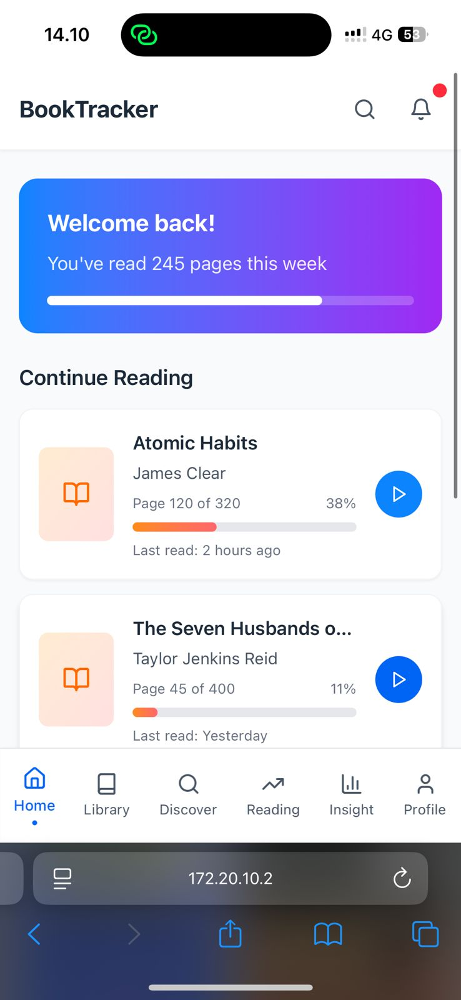
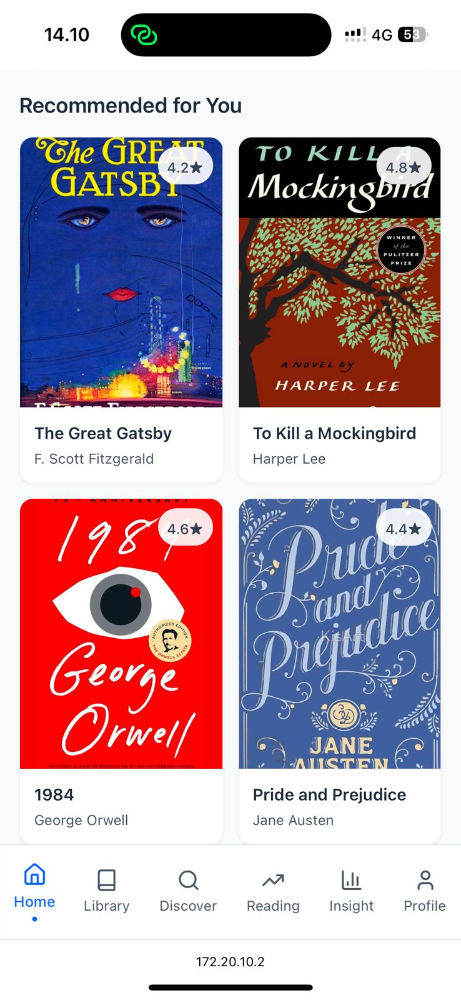
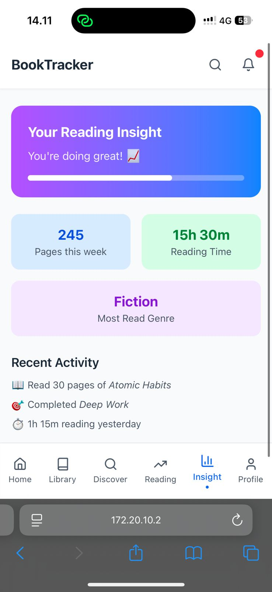
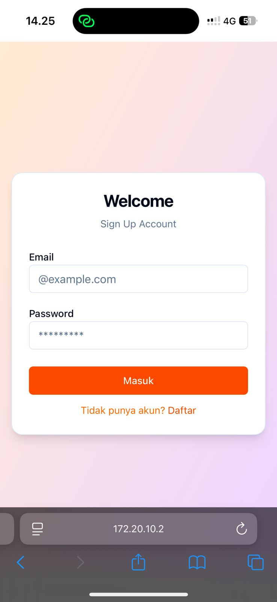
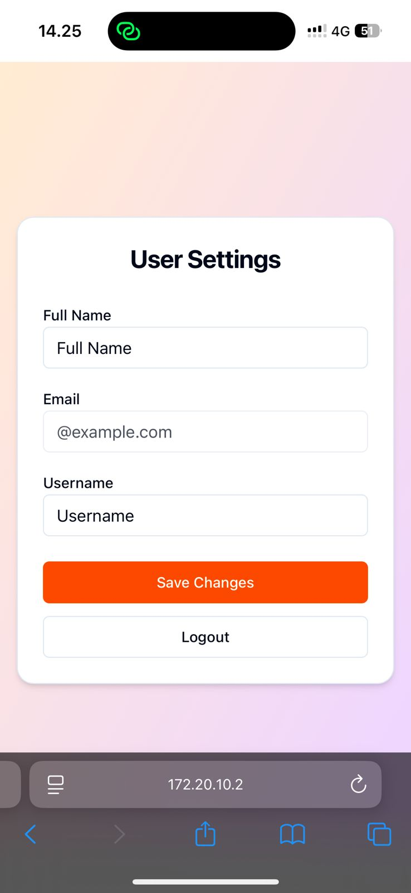
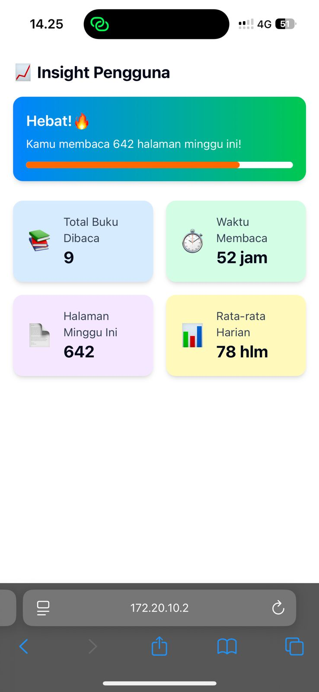

# 📚 CNT Book Tracker App

A full-stack web application for managing your reading list and recommendation book built with Flask and React. Integration with backend only works on page Library section Browse Library.

## 🧑‍💻 My Chosen Role

*Frontend Developer*

I chose the role of frontend developer because I have interest and experience in building responsive and user-friendly user interfaces. I worked on this project using React, Vite, Tailwind CSS, and shadcn/ui.

---

## ✨ Feature

  
  
  

### 1. 🔐 Login Page (User Authentication)

* Created UI login page with input for email and password
* No backend connected yet (mockup only)
* Simple validation and clean styling using Tailwind

📍 Lokasi: src/pages/Login.tsx



### 2. ⚙ User Settings Page

* Account settings page to change name, email, and password
* Display using card UI with responsive input form
* "Save Changes" button available (not yet functional)
  
📍 Lokasi: src/pages/Settings.tsx


  
### 3. 📊 User Insight Page

* Displays dummy statistics such as:
  * Total books read
  * Reading time
  * Average readings per day and per week
* Neat and mobile-friendly layout

📍 Lokasi: src/pages/Insight.tsx



## 🔁 Merge Request

To submit my work, I created a new branch with the command:

bash
git checkout -b frontend-miiiwq
git push origin frontend-miiiwq

Then I made a Pull Request to the main branch in this GitHub repository.

## 📝 Notes

* All pages are dummy UI (not connected to backend), according to the instructions of the question.
* The UI design is made modular and clean using shadcn/ui.
* The file structure is neatly arranged for easy further development (scalable).

```
